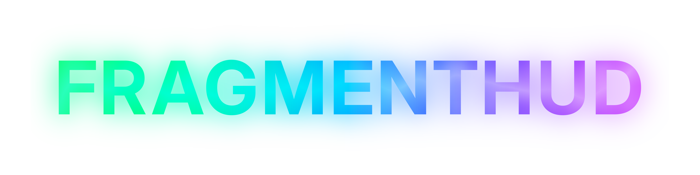

---

# Notice
When downloading the HUD's zip file, the extracted folder **MUST** be named `fragmenthud`.

If it is not, then it will NOT work!

Your `<TF2 ROOT>/tf/` folder should look something similar to this:

```
.
├── ...
├── bin/
├── cfg/
├── custom/
│   ├── ...
│   ├── ...
│   ├── fragmenthud/
│   │   ├── ...
│   │   ├── base/
│   │   ├── extd/
│   │   ├── frag/
│   │   ├── info.vdf
│   │   └── ...
│   ├── ...
│   └── ...
├── maps/
├── resource/
├── scripts/
├── sound/
└── ...
```

# Supported Versions
|Version|Supported|Comments|
|:-:|:-:|:--|
|64-bit|✔️|Primary supported version.|
|32-bit|⚠️|Supported, but more work and focus is put into the 64-bit version.|
|Old x32-bit|❌|Not supported, might not work.|

# Supported Gamemodes
|Gamemode|Supported|Comments|
|:-:|:-:|:--|
|V-Script/V-Slop maps|⚠️|Most should work, but due to the nature of these maps' huds they may break.|
|Attack/Defend|✔️|Fully functional and customized. Includes Medieval.|
|Control Points|✔️|Fully functional and customized.|
|Territorial Control|✔️|Fully functional and customized.|
|KOTH|✔️|Fully functional and customized.|
|CTF|✔️|Fully functional and customized, Includes Special Delivery and Mannpower.|
|Payload|✔️|Fully functional and customized.|
|Payload Race|✔️|Fully functional and customized.|
|PASS Time|⚠️|Fully functional, but is unmodified as of right now.|
|Mann Vs. Machine|⚠️|Customized, but scoreboard is broken as of now.|

# Supported Aspect Ratios
|Ratio|Supported|Comments|
|:-:|:-:|:--|
|4:3|✔️|Supported, all HUD elements fit inside.|
|16:9|✔️|Supported, primary ratio where development is done.|
|21:9|✔️|Supported.|
|32:9|✔️|Supported.|
|5:4|❌|HUD won't fit.|
|Other aspect ratios|⚠️|Divide your resolution's width by its height. If its greater than or equal to `1.333...` then it is supported.|

# Supported Resolutions
|Resolution|Supported|Comments|
|:-:|:-:|:--|
|480p|❌|Please upgrade your monitor.|
|720p (HD)|⚠️|Supported, but some text may be difficult to read.|
|1080p (FHD)|✔️|Supported.|
|1440p (QHD/2K)|✔️|Supported.|
|2160p (UHD/4K)|⚠️|Supported, but due to VGUI limitations some text may render smaller than expected. All HUDs suffer from this issue.|
|Other resolutions|⚠️|If it's between 720p and 2160p, it should work fine.|